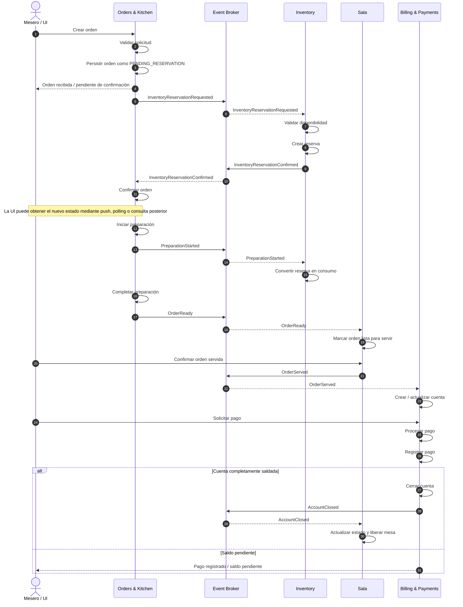
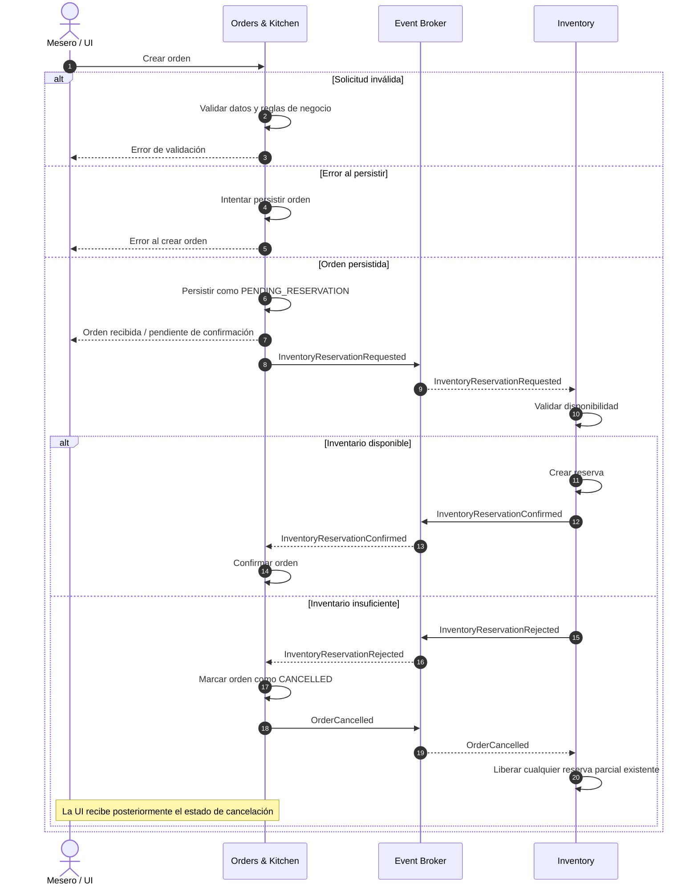
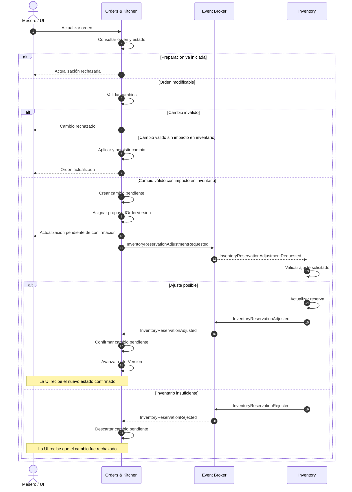
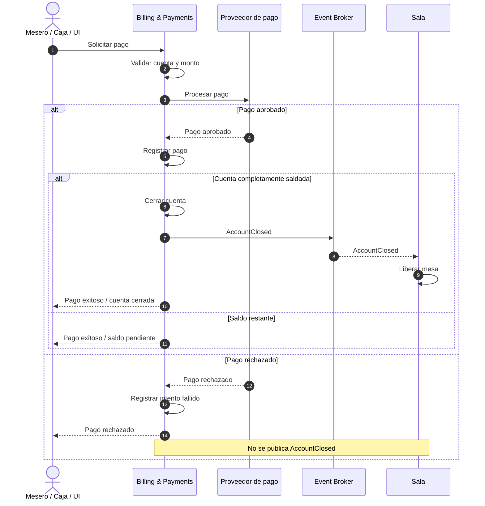
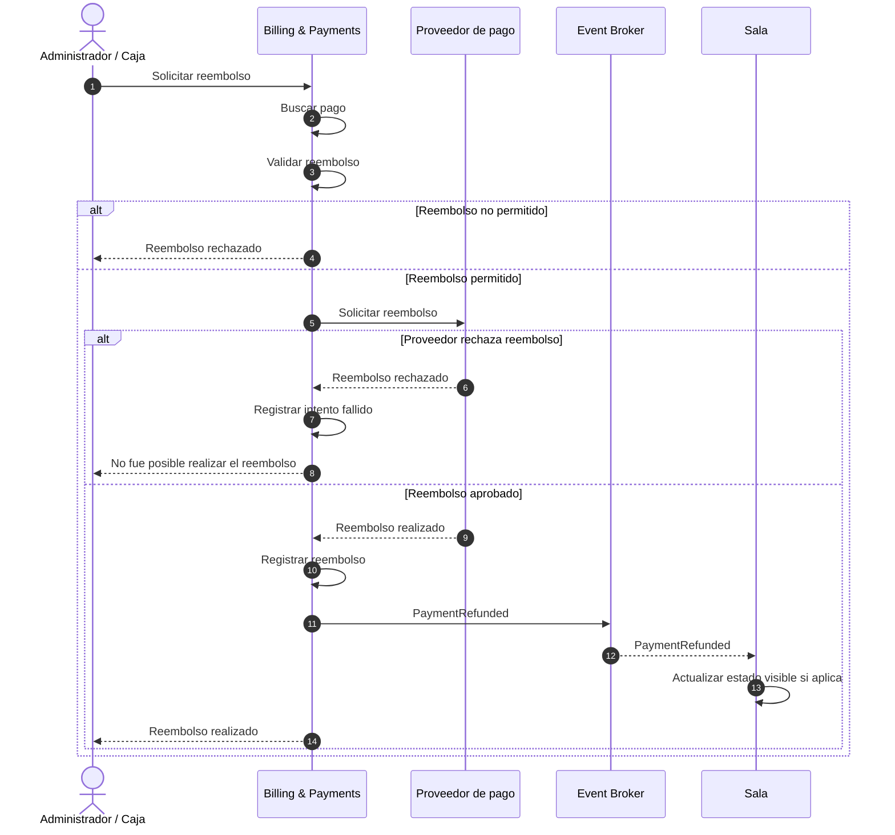
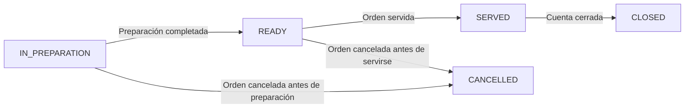
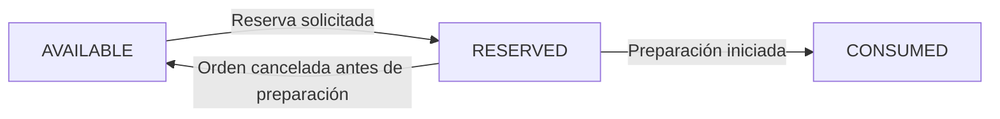
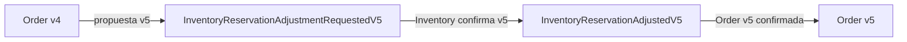
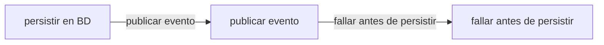

# Eventos de dominio e integración operacional

> Documento de referencia para comprender los mensajes que cruzan los límites de los servicios de FMAT Restaurant.

## Cómo leer este documento

Este documento describe el comportamiento operacional que debe observarse entre servicios. La tabla resume el catálogo publicado y los diagramas muestran los flujos principales, sus respuestas explícitas y las transiciones que permanecen internas a cada contexto.

El contrato machine-readable está disponible en [`FMAT-Restaurant-Events.yml`](FMAT-Restaurant-Events.yml) y su vista navegable se publica mediante [EventCatalog](https://fmat-restaurant.github.io/Documentation/eventcatalog/). Las direcciones de canal, nombres de tipo CloudEvents y formas exactas de los payloads marcadas como `[Propuesta]` siguen abiertas para confirmación del diseño.

## Alcance

Los mensajes publicados mediante el broker representan contratos entre servicios. Los eventos internos de un contexto, como `OrderCreated` u `OrderUpdated`, pueden seguir existiendo dentro de `Orders & Kitchen`, pero no necesitan publicarse si ningún servicio externo los consume directamente.

## Resumen de mensajes operacionales

| Mensaje                                   | Tipo    | Propósito                                                                                         | Productor          | Consumidor         |
| ----------------------------------------- | ------- | ------------------------------------------------------------------------------------------------- | ------------------ | ------------------ |
| `InventoryReservationRequested`           | Comando | Solicitar la reserva inicial necesaria para una orden                                             | Orders & Kitchen   | Inventory          |
| `InventoryReservationConfirmed`           | Evento  | Informar que la reserva inicial fue realizada correctamente                                       | Inventory          | Orders & Kitchen   |
| `InventoryReservationRejected`            | Evento  | Informar que una reserva o ajuste no pudo realizarse                                              | Inventory          | Orders & Kitchen   |
| `InventoryReservationAdjustmentRequested` | Comando | Solicitar el ajuste de una reserva debido a cambios en una orden                                  | Orders & Kitchen   | Inventory          |
| `InventoryReservationAdjusted`            | Evento  | Informar que el ajuste solicitado fue realizado correctamente                                     | Inventory          | Orders & Kitchen   |
| `PreparationStarted`                      | Evento  | Informar que comenzó la preparación y que la reserva correspondiente puede considerarse consumida | Orders & Kitchen   | Inventory          |
| `OrderCancelled`                          | Evento  | Informar que una orden fue cancelada y liberar reservas que aún no hayan sido consumidas          | Orders & Kitchen   | Inventory          |
| `OrderReady`                              | Evento  | Informar que una orden está lista para ser servida                                                | Orders & Kitchen   | Sala               |
| `OrderServed`                             | Evento  | Informar que una orden fue servida                                                                | Sala               | Billing & Payments |
| `AccountClosed`                           | Evento  | Informar que una cuenta quedó completamente saldada y cerrada                                     | Billing & Payments | Sala               |
| `PaymentRefunded`                         | Evento  | Informar que un pago fue reembolsado                                                              | Billing & Payments | Sala               |

---

## 1. Creación de orden hasta finalización — Happy Path



---

## 2. Creación de orden con falla



---

## 3. Actualización de una orden

El control sobre si la orden ya comenzó a prepararse pertenece a `Orders & Kitchen`.

Una actualización que no modifica los requerimientos de inventario puede aplicarse inmediatamente.

Una actualización que sí modifica los requerimientos debe esperar la confirmación de Inventory antes de hacerse definitiva.



De esta forma no es necesario:

```text
actualizar
→ confirmar al usuario
→ Inventory rechaza
→ revertir actualización
```

El cambio únicamente se vuelve definitivo cuando Inventory confirma el ajuste.

---

## 4. Fallo de pago



`AccountClosed` solo se publica cuando el saldo de la cuenta llega efectivamente a cero.

Un pago exitoso individual no implica necesariamente que la cuenta completa haya sido cerrada.

---

## 5. Reembolso

El reembolso pertenece al dominio de pagos, por lo que el evento representa un pago reembolsado y no una orden reembolsada.



Un `PaymentRefunded` no implica automáticamente que la mesa deba volver a abrirse ni que la orden cambie de estado.

---

## 6. Estados internos de preparación

Los estados internos:



Pertenecen a `Orders & Kitchen`.

No es necesario publicar cada transición en el broker.

La única excepción operacional es:

```text
PreparationStarted
```

porque Inventory necesita conocer ese momento para transformar:


La finalización de la preparación produce:

```text
OrderReady
```

porque Sala sí necesita reaccionar a ese hecho.

---

## Ciclo de inventario

La reserva debe tener una semántica explícita:



Una vez que una reserva ha pasado a `CONSUMED`, una cancelación posterior de la orden no debe restaurar automáticamente ese inventario.

Cualquier devolución física de inventario después de comenzar la preparación debe tratarse mediante una operación explícita de ajuste de inventario.

---

## 7. Correlación y versionado

Inventory debe ignorar mensajes duplicados y evitar aplicar una actualización correspondiente a una versión obsoleta.

Ejemplo:



Un rechazo correspondiente a `v4` o a una solicitud anterior no debe modificar una orden que ya se encuentre en `v5`.

---

## Reglas de confiabilidad

Los consumidores de los eventos deben ser idempotentes.

La publicación de mensajes debe evitar el problema:



por lo que es recomendable utilizar el patrón **Transactional Outbox**.

Los consumidores pueden utilizar un **Inbox / processed-message store** para detectar mensajes ya procesados.

La consistencia entre servicios es eventual y ninguna operación debe depender de que la ausencia de un evento signifique éxito.

Por eso siempre existen respuestas explícitas:

```text
InventoryReservationConfirmed
```

o:

```text
InventoryReservationRejected
```

en lugar de asumir que:

```text
"No llegó rechazo" = "la reserva fue aceptada"
```
